# Plots

The results of the runs are shown in the plots below. The following plots are available for visualization. The `RunId` describes the run currently selected via the buttons. Each run is contained as a .zip file in the summaries folder. The URL for the `PUBLIC_SVN` is: [https://svn.vsp.tu-berlin.de/repos/public-svn/matsim/scenarios/countries/de/episim]()

| Plot name | Short name | File name |
|---------|--|--|
| [Activity Levels by Type](#activity-levels-by-type) | actLevPerTyp | ActivityLevelsPlot |
| [Disease Import](#disease-import) | disImp | DiseaseImport |
| [Hospitalization New Cases (post-process)](#hospitalization-new-cases-post-process) | hosNewCasPos | PostHospital |
| [Hospitalization Rate (post-process)](#hospitalization-rate-post-process) | hosRatPos | PostHospital |
| [Cases Comparison](#cases-comparison) | casCom | WeeklyInfectionsPlot |
| [Virus Strains](#virus-strains) | virStr | MutationsPlot |
| [Simulated R-Values](#simulated-r-values) | simRVal | RValuePlot |
| [Simulated R-Values by Purpose](#simulated-r-values-by-purpose) | simRValByPur | RValueTwo |
| [Infections by Activity Type](#infections-by-activity-type) | infByActTyp | InfectionsByActivityType |
| Vaccine Effectiveness (against infection) | vacEffAgaInf | Vaccination EffectivenessPlot |
| Vaccine Effectiveness Vs. Strain | vacEffVsStr | VaccinationEffectiveness- VsStrain |
| [Incidence comparison between vaccinated and unvaccinated persons](#incidence-comparison-between-vaccinated-and-unvaccinated-persons) | incComVacAndUnvac | WeeklyInfection- ByVaccination |
| [Vaccination Rates and Booster Rates](#vaccination-rates-and-booster-rates) | VacRatBooRat | VaccinationRates |
| [Vaccination per Type](#vaccination-per-type) | VacPerTyp | VaccinationPerType |
| Antibodies | Antibodies | Antibodies |
| [Hospitalization New Cases](#hospitalization-new-cases) | hospNewCas | Hospitalization7- DayNewCasesPlot |
| [Hospitalization Rate Comparison](#hospitalization-rate-comparison) | hospRatComp | HospitalizationPlot |
| [Hospitalization Rate Comparison for vaccinated and unvaccinated persons](#hospitalization-rate-comparison-for-vaccinated-and-unvaccinated-persons) | hospRatCompVacAndUnvac | Hospitalization- VaccinationComparison |
| [Simulated Health Outcomes Over Time](#simulated-health-outcomes-over-time) | simHealOutOveTim | HealthOutcomes |
| [7-Day Incidence by Age Group Over Time (Heatmap)](#7-day-incidence-by-age-group-over-time-heatmap) | inciHeatmap | HeatMap |
| [7-Day Incidence by Age Group Over Time (Linechart)](#7-day-incidence-by-age-group-over-time-linechart) | inciLinechart | AgeGroupLineChart |
| [Leisure Outdoor Fraction](#leisure-outdoor-fraction) | leiOutFra | LeisureOutdoorFraction |
| [Weekly Tests](#weekly-tests) | weekTest | WeeklyTests |

## Activity Levels by Type

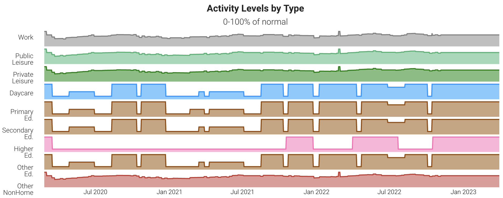

Data basis: `RunId + '.restrictions.txt.csv'`

## Disease Import

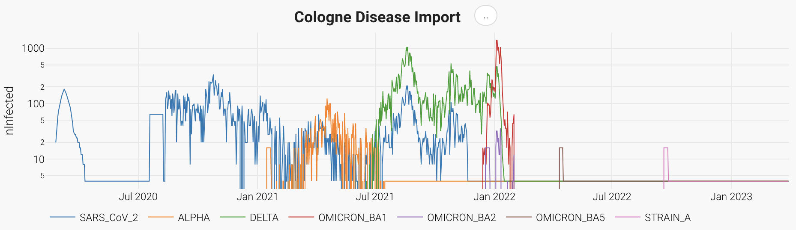

Data basis: `RunId + '.diseaseImport.tsv'`

## Hospitalization New Cases (post-process)

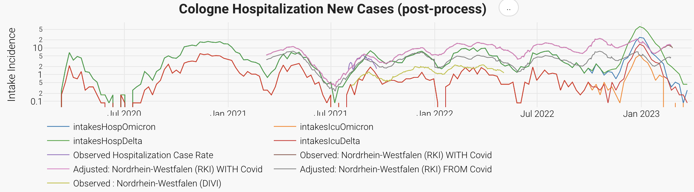

Data basis: `RunId + '.post.hospital.tsv'`

## Hospitalization Rate (post-process)

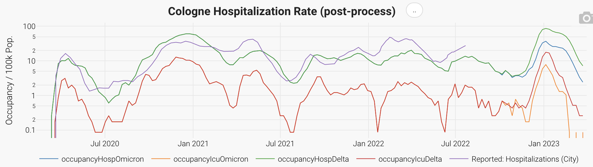

Data basis: `RunId + '.post.hospital.tsv'`

## Cases Comparison

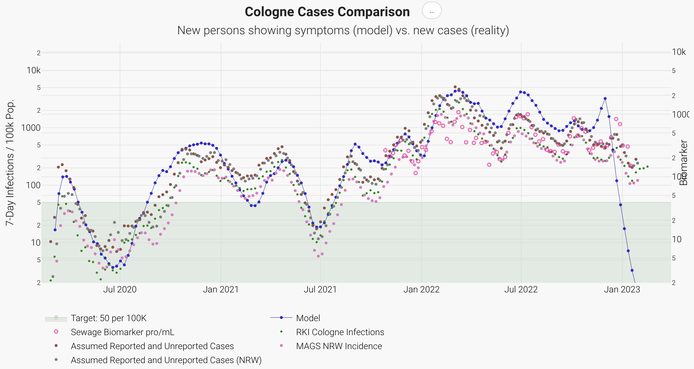

Data basis:
- Model data: `RunId + '.infections.txt.csv'`
    <!-- - nShowingSymptomsCumulative column or if that is not present the difference from the Susceptible column. -->
- Sewage data: `PUBLIC_SVN + 'original-data/Abwasser/CologneSewageDataCleaned.csv'`

## Virus Strains

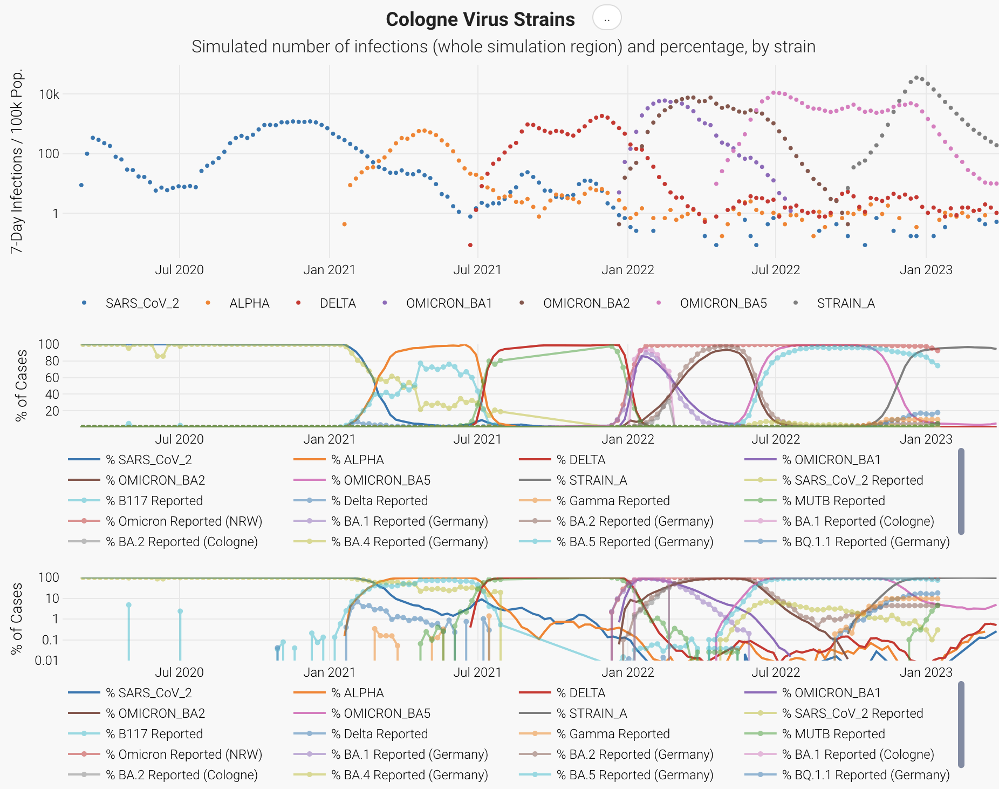

Data basis: 
- First plot: `PUBLIC_SVN + 'original-data/Fallzahlen/' + 'Cologne/VOC_Cologne_RKI.csv' respectively 'Berlin/VOC_Berlin.csv'`
- Second and third plot: `RunId + '.strains.tsv'`

## Simulated R-Values

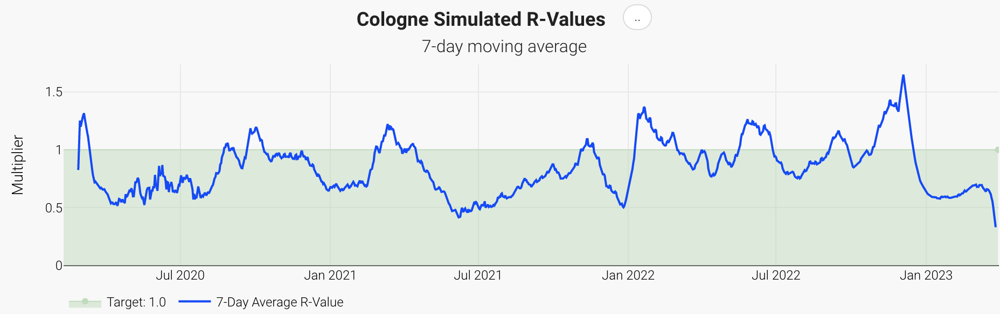

Data basis: `RunId + '.infections.txt.csv'`

## Simulated R-Values by Purpose

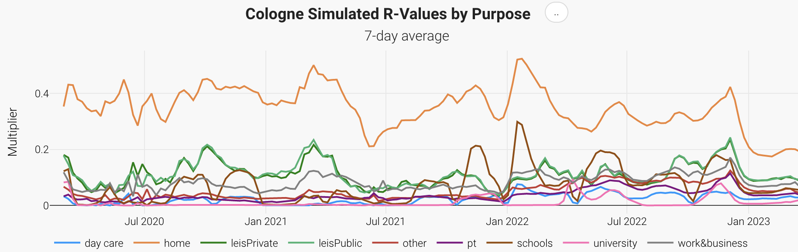

Data basis: `RunId + '.infections.txt.csv'`

## Infections by Activity Type

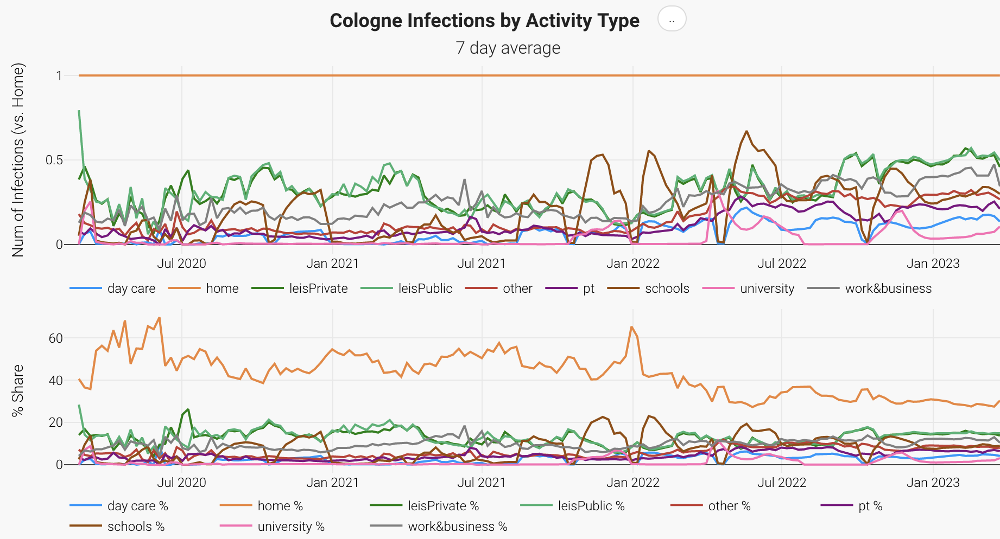

Data basis: `RunId + '.infectionsPerActivity.txt.tsv'`

## Incidence comparison between vaccinated and unvaccinated persons

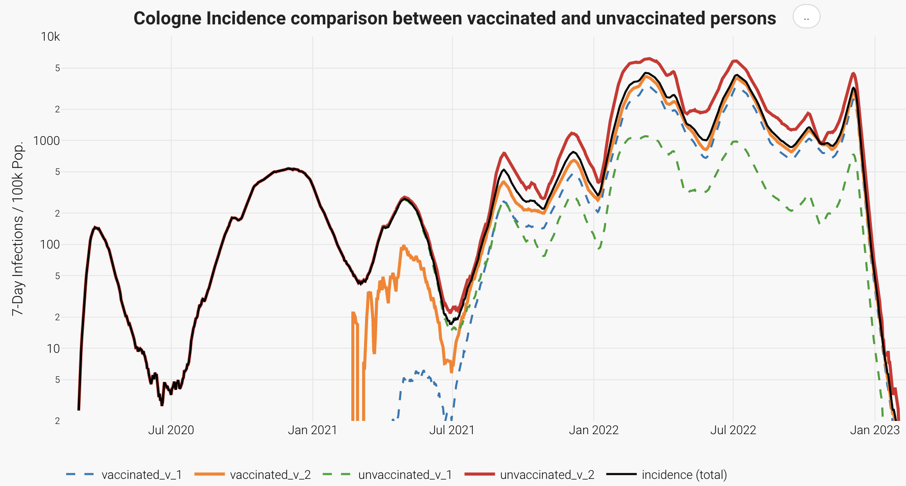

Data basis: `PUBLIC_SVN + 'original-data/Fallzahlen/RKI/' + e.g. 'cologne-cases.csv'`

## Vaccination Rates and Booster Rates

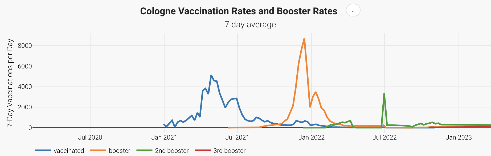

Data basis: `RunId + '.vaccinationsDetailed.tsv'`

## Vaccination per Type

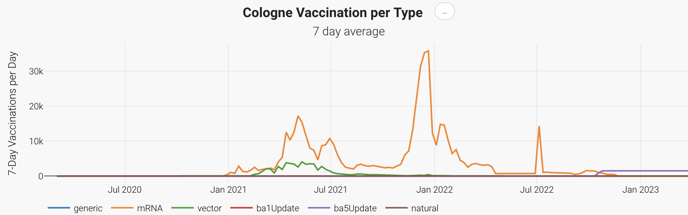

Data basis: `RunId + '.vaccinations.tsv'`

## Hospitalization New Cases

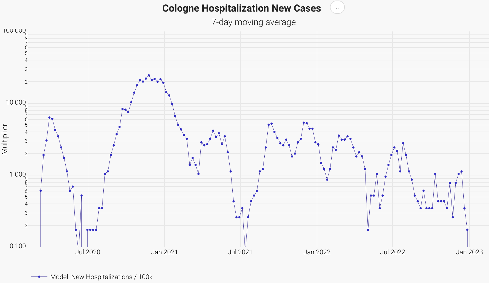

Data basis: `RunId + '.infections.txt.csv'`

## Hospitalization Rate Comparison

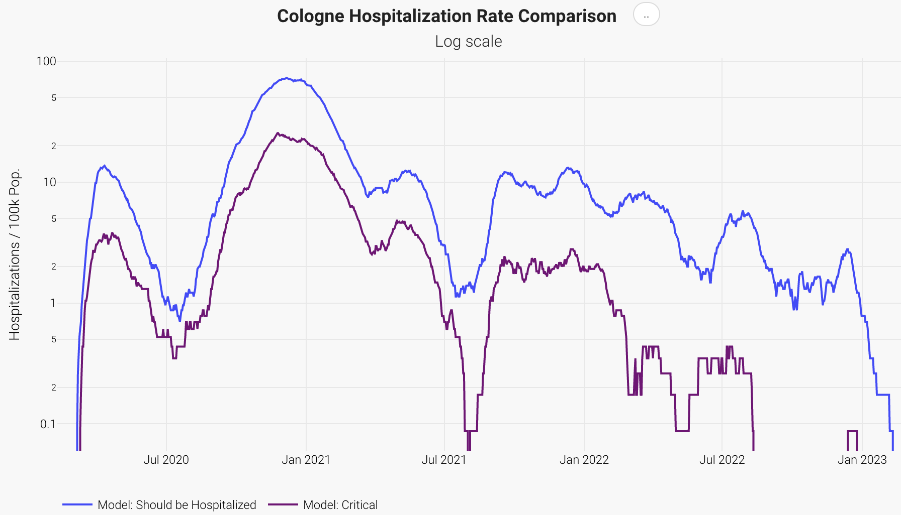

Data basis: `RunId + '.infections.txt.csv'`

## Hospitalization Rate Comparison for vaccinated and unvaccinated persons

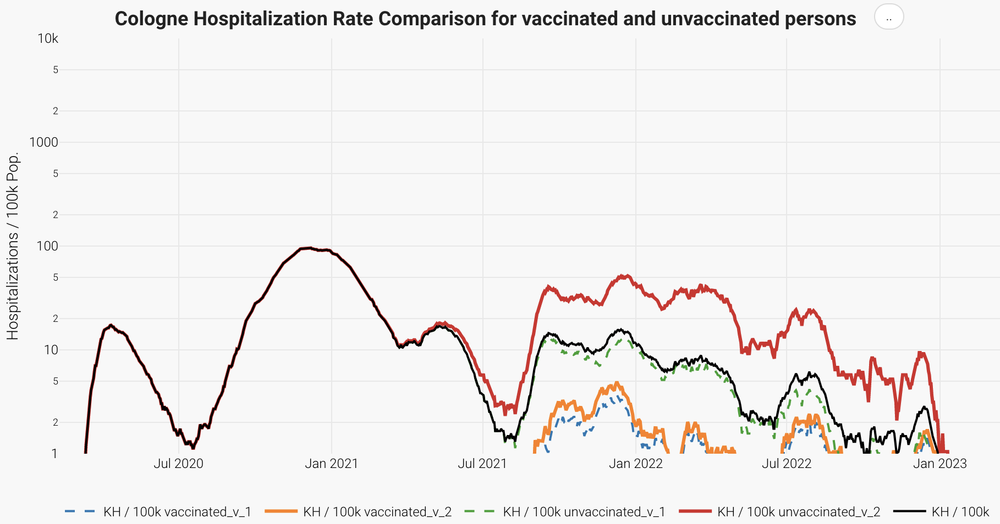

Data basis: `RunId + '.infections.txt.csv'`

## Simulated Health Outcomes Over Time

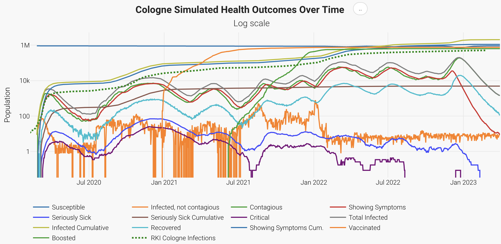

Data basis: `RunId + '.infections.txt.csv'`

## 7-Day Incidence by Age Group Over Time (Heatmap)

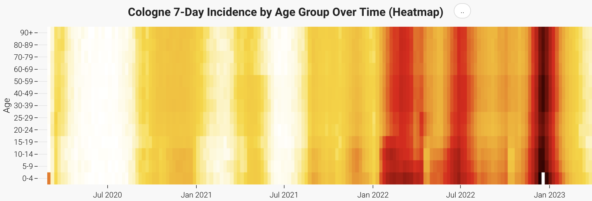

Data basis: `RunId + '.post.incidenceByAge.tsv'`

## 7-Day Incidence by Age Group Over Time (Linechart)

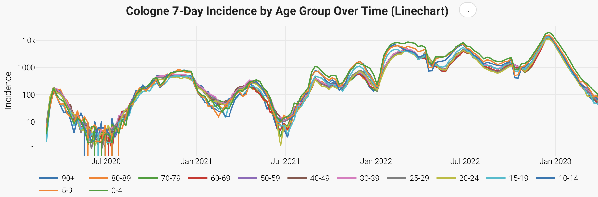

Data basis: `RunId + '.post.incidenceByAge.tsv'`

## Leisure Outdoor Fraction

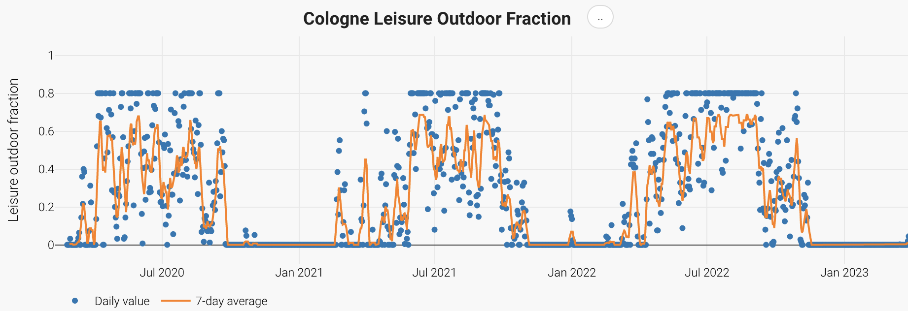

Data basis: `RunId + '.outdoorFraction.tsv'`

## Weekly Tests

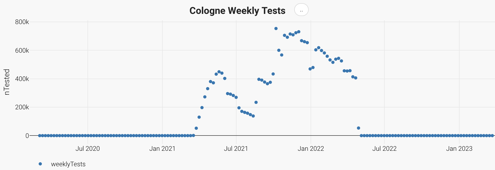

Data basis: `RunId + '.infections.txt.csv'`